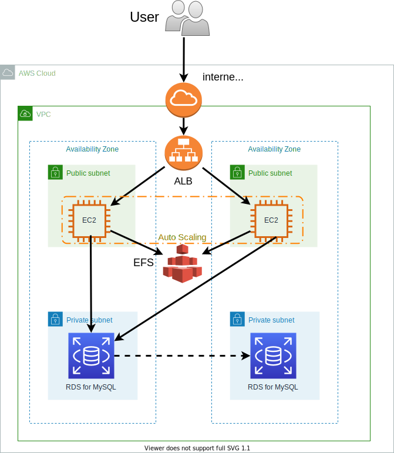

## 構成図


## ローカル環境
- macOS Catalina 10.15.7
- aws-cli/2.0.54
- Terraform v0.13.5
- aws v3.14.1 #Terraform AWS プロバイダー

## 事前準備

### awscliインストール
```
$ curl "https://awscli.amazonaws.com/AWSCLIV2.pkg" -o "AWSCLIV2.pkg"
$ sudo installer -pkg AWSCLIV2.pkg -target /
$ aws --version
```

### tfenvセットアップ
- tfenv Terraformのバージョンマネージャーをインストール

```
$ brew install tfenv
$ tfenv --version
```

- インストールできるバージョン一覧取得

```
$ tfenv list-remote
```

- 特定バージョンをインストール

```
$ tfenv install 0.13.5
```

- バージョン切り替え

```
$ tfenv use 0.13.5
```

- インストールバージョン取得

```
$ tfenv list
```

### IAMユーザ作成
AWSマネジメントコンソールにて、Terraformを実行するためのIAMユーザを作成します。
- 1.AWSマネジメントコンソールから**サービス**から**IAM**を検索します。
- 2.**アクセス管理**の**ユーザー**より、**ユーザを追加**をクリックします。
- 3.ユーザー名に**terraform**と入力し、アクセスの種類で**プログラムによるアクセス**チェックを入れ、**次のステップ:アクセス権限**をクリックします。
- 4.**既存のポリシーを直接アタッチ**をクリックし、**AdministratorAccess**にチェックを入れ、**次のステップ：タグ**をクリックします。
- 5.タグは追加せず**次のステップ：確認**をクリックします。
- 6.内容を確認し**ユーザーの作成**をクリックします。
- 7.アクセスキーIDとシークレットアクセスキーが表示されるのでメモをとり、念のため**csvのダウンロード**をクリック後に**閉じる**をクリックします。

### AWS CLI設定
設定ファイルと認証情報ファイルの設定をします。
以下のコマンドを実行します。

```
$ aws configure
AWS Access Key ID [None]: {アクセスキー}
AWS Secret Access Key [None]: {シークレットアクセスキー}
Default region name [None]: ap-northeast-1
Default output format [None]: json
```

### EC2用のキーペア作成
EC2にssh接続するために、秘密鍵と公開鍵を作成します。

事前にTerraformののソースコードがあるディレクトリへ移動願います。
今回は**wp_ec2**という名前で作成してください。

```
$ ssh-keygen -t rsa -f wp_ec2 -N ''
```

## Terraformリソース作成
GitHubからコードをクローンします。

```
git clone https://github.com/inomaso/terraform_wordpress_ec2.git
```

Terraformのソースコードがあるディレクトリに移動します。
まずはリソース作成に必要なバイナリファイルをダウンロードします。

```
$ terraform init
```

``Terraform has been successfully initialized!``と表示されることを確認してください。

次に実行計画を表示します。

```
$ terraform plan
```

エラーが表示されないことと、新規作成されるリソースを確認します。

実行計画で問題ないことを確認できましたら、実際にリソースを作成します。

```
$ terraform apply
```

``Enter a value:``で、**yes**と入力します。

RDSはリソース作成が完了するのに約20分程度の時間がかかります。

## 動作確認

### Webサイトアクセス確認
``terraform apply``でコンソールに表示された``elb_dns_name``の値をコピーし、ブラウザのアドレスバーにそのまま貼り付け＆実行し、アクセスできるか確認します。

### RDSアクセス確認
WordPressのインストール画面を進めていくと、データベース接続のための詳細設定画面が表示されるため、以下のように入力します。
**データベースのホスト名**は``terraform apply``でコンソールに表示された``rds_endpoint``の値を入力してください。

- データベース名：**wpdb**
- ユーザー名：**dbadmin**
- パスワード：**SuperSecret**
- データベースのホスト名：**RDSエンドポイント名**
- テーブル接頭辞：**wp_**

「WordPressは現在データベースと通信できる状態にあります。」と表示されれば、EC2とRDSは問題なく通信できています。

## Terraformリソース削除
今回作成したリソースを削除します。

```
$ terraform destroy
```

``Enter a value:``で、**yes**と入力します。

リソースの全体削除に7分程度の時間がかかります。
